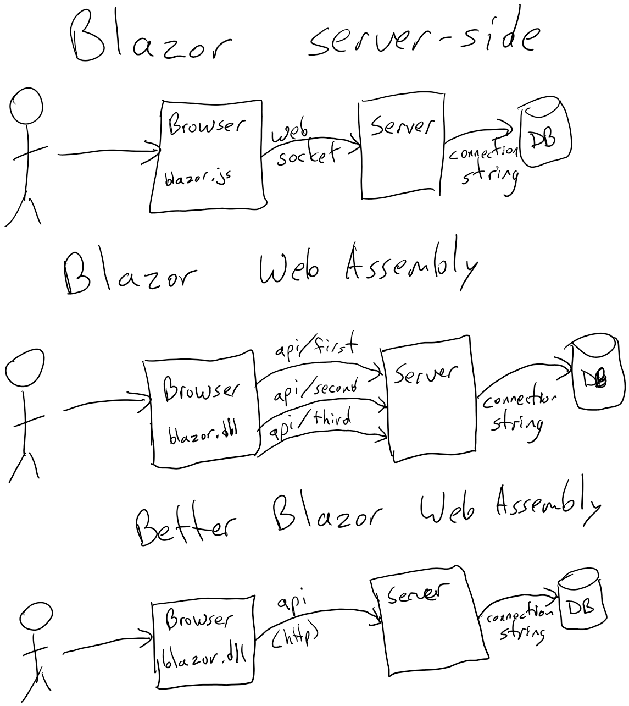

Thanks to [Clear Measure](https://www.clearmeasure.com) for sponsoring this sample and episode of [Programming with Palermo](https://www.palermo.network).

# Json Serialization
With Blazor's implementation of WASM, the front end and the backend of a Blazor C# project is separated. This means that for the WASM project to run on the client side it needs to interact with a server to send and receive data. This is possible using API's however it's far too easy to create many api controllers for every reason to call to the server. With this Json Serialization pattern you will create a single API to send/receive data from the front end to the back end. This patterns prevents the creation of hundreds of API endpoints for Blazor WebAssembly applications as they grow.

This demo will be going over what code is needed to be added to both the frontend and the backend. And how to add additional queries to your application.



## Getting Started
> Note: You can download the repository and move to the next section if you want to have the project already running. 

If you want to create a new application and not use the existing one, start by creating a new Blazor Web Assembly application. When going through the creating process make sure you have (**ASP .NET Core hosted**) checked. This will create the "Server" web service and a "Shared" project. Make sure both Client and Server application have a Reference to the Shared project. They do not need to reference each other. 

### Shared Project
- For this next step I would recommend downloading the solution and only copying over the **Shared** project and replace it with the new **Shared** you just created. I wont be showing each of the files code in this document but they are all required for this to run properly.

### Server Project
- To get started, create a new Folder called "Handlers". This is where you will be creating your handlers to handle the requests made using MediatR.
- Add the **MediatR** Nuget package and **MediatR.Extensions.Microsoft.DependencyInjection** Nuget Package
- **Program.cs** - Add this to the top of the file right about where app is defined. This allows dependency injection into your razor pages and initializes MediatR.
```
builder.Services.AddControllersWithViews();
builder.Services.AddRazorPages();
builder.Services.AddEndpointsApiExplorer();
builder.Services.AddSwaggerGen();

builder.Services.AddMediatR(Assembly.GetExecutingAssembly());
builder.Services.AddTransient<IBus, Bus>();
```
- **WeatherForecastController.cs** - This is the only API that will be needed for the application to run. You can change the name of the controller. Make sure you don’t change any of the code however. If you wish to change the Controller make sure you update the call in **PublisherGateway.cs** in the Shared application and in the **SendToTopic** method.
```
[ApiController]
[Route("your-chosen-url")]
public class ApiController : ControllerBase
{
    private readonly IBus _bus;

    public WeatherForecastController(IBus bus)
    {
        _bus = bus;
    }

    [HttpPost]
    public async Task<string> Post(WebServiceMessage webServiceMessage)
    {
        var result = await _bus.Send(webServiceMessage.GetBodyObject()) ?? throw new InvalidOperationException();
        return new WebServiceMessage(result).GetJson();
    }
}
```


### Client Project
- Counter.razor - This is just a demo the logic is not practical but is intended to show the implantation of the pattern
```
@page "/counter"
@using WebAssemblyWithAPI.Shared
@using WebAssemblyWithAPI.Shared.Queries

@inject IBus Bus

<PageTitle>Counter</PageTitle>

<h1>Counter</h1>

<p role="status">Current count: @currentCount</p>

<button class="btn btn-primary" @onclick="IncrementCount">Click me</button>

<p>@returnValue</p>

@code {
    private int currentCount = 0;
    private string returnValue = "";

    private async void IncrementCount()
    {
        currentCount++;
        var newCount = await Bus.Send(new CounterQuery(currentCount));
        returnValue = $"{newCount.NewCount} from server process '{newCount.ServerProcessName}'";
        StateHasChanged();
    }
}
```
- FetchData.razor - This is just a demo the logic is not practical but is intended to show the implantation of the pattern
```
@page "/fetchdata"
@using WebAssemblyWithAPI.Shared
@using WebAssemblyWithAPI.Shared.Models
@using WebAssemblyWithAPI.Shared.Queries
@inject IBus Bus

<PageTitle>Weather forecast</PageTitle>

<h1>Weather forecast</h1>

<p>This component demonstrates fetching data from the server.</p>

@if (forecasts == null)
{
    <button class="btn btn-primary" @onclick="LoadData">Load Data</button>
}
else
{
    <table class="table">
        <thead>
        <tr>
            <th>Date</th>
            <th>Temp. (C)</th>
            <th>Temp. (F)</th>
            <th>Summary</th>
        </tr>
        </thead>
        <tbody>
        @foreach (var forecast in forecasts)
        {
            <tr @onclick="@(()=>Select(forecast))">
                <td>@forecast.Date.ToShortDateString()</td>
                <td>@forecast.TemperatureC</td>
                <td>@forecast.TemperatureF</td>
                <td>@forecast.Summary</td>
            </tr>
        }
        </tbody>
    </table>
}

@if (Data != null)
{
    <h2>@Data.ForecastDetails</h2>
    <button class="btn btn-primary" @onclick="Update">Update</button>
}

@code {
    private WeatherForecast[] forecasts;
    private AdditionalForecastData Data;
    private WeatherForecast SelectedForecast;

    private async Task LoadData()
    {
        forecasts = await Bus.Send(new ForecastQuery());
        StateHasChanged();
    }

    private async Task Select(WeatherForecast selected)
    {
        SelectedForecast = selected;
        Data = await Bus.Send(new AdditionalForecastQuery(selected.Id));
        StateHasChanged();
    }

    private async Task Update()
    {
        forecasts = await Bus.Send(new UpdateForecastCommand(SelectedForecast.Id, forecasts));
        StateHasChanged();
    }
}
```

### Queries
The query uses MediatR to send requests to handlers that will perform whatever action that is defined and then return the values back. If you do not have any prior experience with MediatR I will be going over the bare minimum that is required for this pattern to be properly implemented.

- Create a new Query: Add a new cs class to the Queries file under the "Shared" project. 
- Add this inheritance 
```
IRequest<WeatherForecast[]>, IRemoteableRequest
```
- For the IRequest, the type that is referenced here is the Return type that you expecting as a result from the Handler
- If you want to pass any data to the Handler declare it in this class as properties. 
- Next lets create the Handler: Go the "Server" project and add a new cs file to the Handlers folder
- Add this inheritance: 
```
 IRequestHandler<ForecastQuery, WeatherForecast[]>
```
- The first type is the Query that this handler is for. The second is the Return type that you defined in the Query
- Next create the Handle method like this
```
    public class ForecastQueryHandler : IRequestHandler<ForecastQuery, WeatherForecast[]>
    {
        public Task<WeatherForecast[]> Handle(ForecastQuery request, CancellationToken cancellationToken)
        {
            return Task.FromResult(new WeatherForecastData().GetAll());
        }
    }
```
- Now we are going to move to the "Client" project to add the call in the razor page.
- At the top make sure you inject the IBus
```
@inject IBus Bus
```
- The next code block is all you need to send the request and wait for the response. Make sure you initialize your query (Fill in any properties that you want to send) before the Send call. The result is going to be whatever you defined as the return type in your query.
```
forecasts = await Bus.Send(new ForecastQuery());
StateHasChanged();
```

## Conclusion
Using this pattern allows developers to simply create queries and handlers without having to worry about various API endpoints. This will in return allow the Client-side application to only make one connection to send all requests. All the Serialization is done for the developer so they only have to worry about what data they need and what data they want to send


Thanks to [Clear Measure](https://www.clearmeasure.com) for sponsoring this sample and episode of [Programming with Palermo](https://www.palermo.network).
